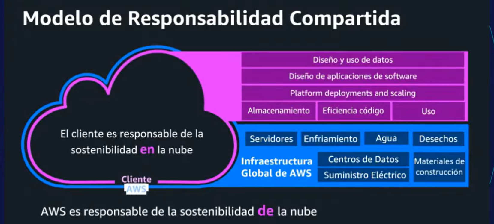

# climate pledge
compromiso para alcanzar el 0 neto en emisiones de carbono para 2040

# sostenibilidad
satisfacer las necesidades del presente sin comprometer las capacidades de las generaciones futuras para satisfacer sus propias necesidades

- de la nube: migracion
- en la nube: optimizacion
- a traves de la nube: transformacion

