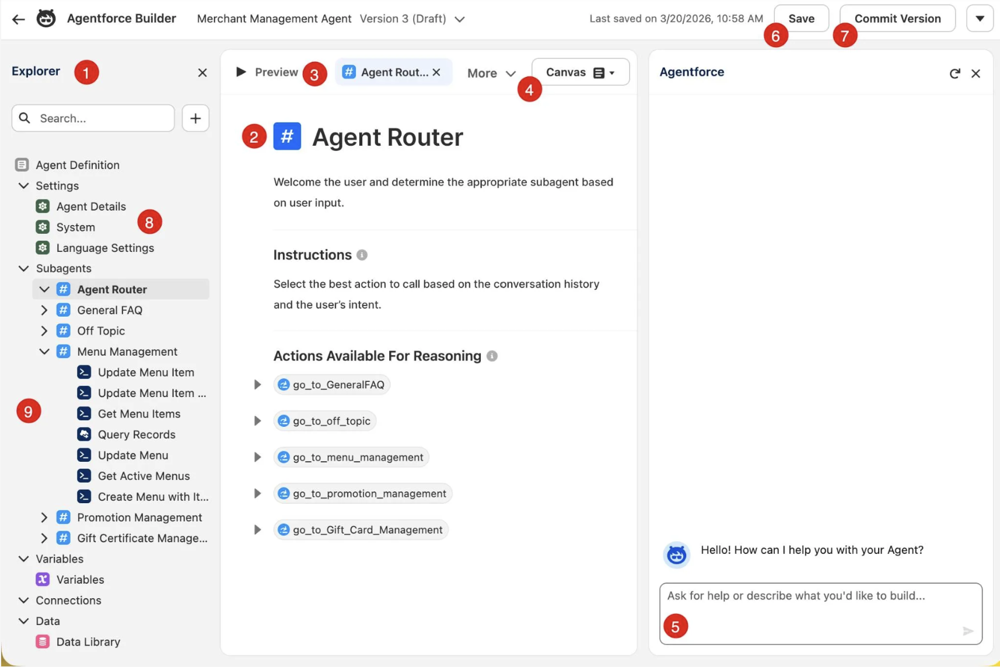

# El poder de los agentes autónomos
Los agentes de IA autónomos como los de Coral Cloud entienden las solicitudes, las responden y, luego, actúan sin intervención humana. Con un objetivo, el agente se genera tareas y las completa una por una hasta cumplir el objetivo. A diferencia de los chatbots tradicionales que siguen reglas predefinidas, los agentes autónomos operan en entornos dinámicos; por ese motivo, son ideales para las tareas complejas de atención al cliente, marketing, comercio, ventas, etc.

Si bien los agentes autónomos no necesitan de los humanos para completar sus tareas, sí requieren que se describan los objetivos ideales y las metas principales que desea alcanzar. 

Los datos son la base de la funcionalidad del agente autónomo. Son lo que permite al agente tomar decisiones fundamentadas y ejecutar tareas de forma autónoma. Con esta información, el agente puede personalizar todos los aspectos de su viaje y ofrecer una estadía agradable y sin problemas.

Cuando un agente autónomo analiza datos, usa algoritmos de toma de decisiones avanzados para priorizar tareas y ejecutarlas con eficiencia. Para el agente conserje de Coral Cloud Resorts, eso significa evaluar las diversas opciones y situaciones para garantizar que todas las decisiones se alinean con las preferencias y los objetivos 

Después de tomar decisiones dirigidas por datos, el agente pasa sin dificultades a la ejecución de acciones planificadas. 

Con el tiempo, el agente aprende continuamente de cada interacción y se adapta para mejorar su desempeño a futuro. Analiza comentarios y resultados para perfeccionar su algoritmo y proceso de toma de decisiones y, así, satisfacer las necesidades del cliente.

## La prioridad principal es la seguridad

- Definir límites claros: Establezca límites claros de lo que pueden hacer los agentes autónomos. Con restricciones claras, se evita el uso indebido y garantiza que los agentes operen dentro de los límites éticos y de seguridad.
- Implementar medidas de seguridad sólidas: Use código, almacenamiento de datos seguro, controles de acceso y auditorías de seguridad periódicas para proteger la información de los clientes. Asegúrese de que los agentes cumplen con las leyes de protección de datos.
- Supervisar y auditar: Supervise de forma periódica el desempeño de los agentes autónomos y audite sus acciones. De esta manera, puede detectar a tiempo errores o comportamiento inadecuado y realizar ajustes según sea necesario.
- Integrar la supervisión humana
- Garantizar la transparencia: Su organización debe ser transparente con los clientes en cuanto a cómo usa los agentes autónomos. Deben saber cuándo están interactuando con un agente autónomo y tener la opción de hablar con un representante humano de ser necesario.
- Probar de forma exhaustiva: Antes de implementar los agentes autónomos, pruébelos de forma exhaustiva para identificar posibles problemas y solucionarlos. 
- Aprender y mejorar continuamente

# Personalizar el agente

- Utilice herramientas de la paleta Explorer (Explorador) para agregar o modificar subagentes, acciones, variables, fuentes de datos, etc., de manera que se cumplan sus necesidades. (1)
- Modifique su agente en el panel Canvas (Lienzo) con el editor en lenguaje natural. Si lo prefiere, puede añadir lógica a su agente con acciones rápidas; también puede utilizar el selector para agregar recursos como subagentes, acciones y variables. (2)
- Pruebe su agente en el modo Preview (Vista previa) y, a continuación, vea los detalles de las conversaciones en segundo plano que muestran los subagentes, las acciones, las instrucciones y el razonamiento que ha utilizado el agente a fin de responder a las solicitudes. Según el rendimiento de su agente, puede ajustar aún más sus personalizaciones hasta que cumpla sus requisitos. (3)
- Cambie entre el lienzo basado en lenguaje natural y las vistas de script basadas en código. Los cambios que realice en la vista de lienzo se mostrarán en la vista de script y viceversa. (4)
- Interactúe con su agente en el panel Conversation Preview (Vista previa de la conversación) utilizando situaciones reales para las que se haya diseñado (o no) a fin de saber cómo funciona. (5)
- Guarde el borrador de su agente. (6)
- Confirme una versión de su agente que pueda activar para que esté disponible para los usuarios. No puede modificar una versión confirmada de su agente, pero puede crear un borrador y modificarlo. (7)
- Modifique los detalles de su agente en el menú Settings (Configuración). Aquí podrá modificar el nombre y la descripción del agente, establecer los idiomas en los que podrá responder el agente y elaborar instrucciones que guíen al agente a la hora de interactuar con los usuarios. También puede personalizar los mensajes de bienvenida o de error para que se ajusten al estilo de su empresa. (8)
- Añada o actualice subagentes y acciones agregándolos a la biblioteca de activos o creando otros nuevos. (9)

# Subagentes y acciones personalizados
 Los subagentes y las acciones personalizadas permiten a los agentes centrarse, completar tareas de forma eficiente y ofrecer orientación en función de las necesidades únicas 

 