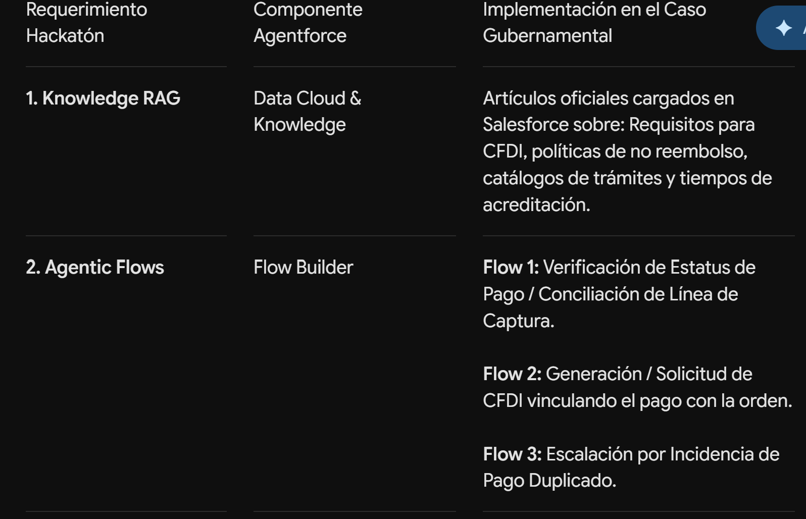
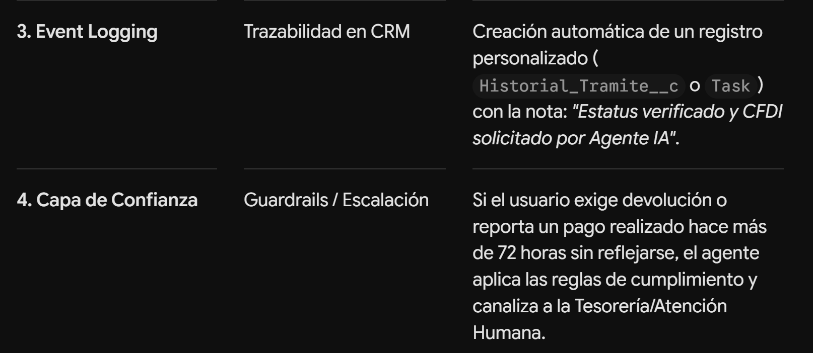

# Cómo Colaboraremos Durante el Proceso

- Diseño de Arquitectura: Validaremos los objetos, campos y flujo de datos requeridos en tu Org.

- Construcción y Prompting: Redactaremos las descripciones exactas de las acciones y las instrucciones del agente para maximizar la precisión de Atlas.

- Desarrollo Declarativo / Código: Diseñaremos la lógica de los Flows y los componentes Apex necesarios.

- Depuración (Reasoning Logs): Analizaremos los registros de razonamiento de Agent Builder para corregir desviaciones en las decisiones del agente.

- Estrategia para el Demo: Estructuraremos la narrativa del pitch para evidenciar ante los jueces cómo la solución impacta el dolor operativo y cumple al 100% las 4 dimensiones evaluadas.

Resolver la desorganización de trámites, pagos duplicados y la demora en la emisión de comprobantes fiscales (CFDI) en los portales gubernamentales de atención ciudadana ataca un problema público real.

# Justificación de por qué es una propuesta ganadora

- Dolor operativo tangible: Las entidades públicas pierden cientos de horas hombre atendiendo aclaraciones de "Pagué dos veces y no me dieron mi servicio" o "Llevo 3 días esperando mi CFDI y vence el mes".

- Alineación con la Capa de Acción (Flows) y Trazabilidad: Las reglas de negocio para validar referencias, verificar transacciones y registrar folios únicos se adaptan a la lógica transaccional de Salesforce Flow y Custom Objects.

- Alto valor percibido por los jueces: Los proyectos de la categoría GovTech u Optimización de Servicios Ciudadanos suelen destacar porque demuestran cómo la tecnología moderna (IA agéntica) soluciona procesos burocráticos.

# Puntos Fuertes (Ventajas para el Pitch y la Evaluación)

- Eliminación de la duplicidad y pagos huérfanos: Mediante un Agentic Flow, el agente puede consultar el estado de una línea de captura a 24 dígitos antes de habilitar un nuevo intento de pago o la generación de una cita.

- Reducción del tiempo de espera del CFDI: El agente puede validar los datos de la Constancia de Situación Fiscal (RFC, Código Postal, Régimen Fiscal) usando Knowledge RAG para explicar los requisitos, y ejecutar un Flow que procese la solicitud y registre la transacción en tiempo real sin requerir atención en ventanilla.

- Capa de Confianza y Escalamiento natural: En casos donde ya existe un cobro indebido o doble pago, el agente identifica el caso crítico (ya que no hay reembolsos directos por sistema) y escala de manera transparente mediante un Flow a Omni-Channel para auditoría humana.

- Trazabilidad clara (Event Logging): Cada consulta, intento de pago o solicitud de CFDI queda vinculada al expediente del ciudadano (Contact / Account en Salesforce) con registros automáticos de auditoría.

Manejo de reglas fiscales en lenguaje natural: Los ciudadanos no siempre conocen su Uso de CFDI o Régimen Fiscal. Solución: Aprovechar la Capa de Inteligencia (Knowledge RAG). Cargar artículos de conocimiento con las reglas del SAT y de la Secretaría de Finanzas para que el agente guíe paso a paso al usuario sin tecnicismos.

# Mapeo de la Solución a la Arquitectura de Agentforce

Definir un nombre atractivo para la solución (por ejemplo: "Agentforce Ciudadano: Conciliación y Facturación Transparente").
