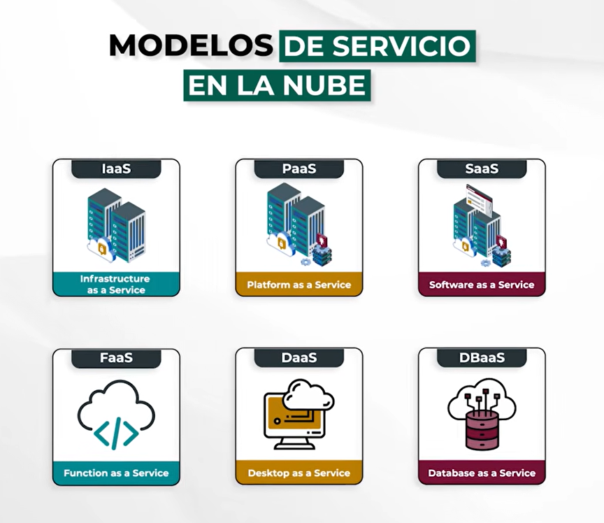

Distintas tecnologias han evolucionado para ofrecer alternativas que peermitan utilizar servicios y recursos informaticos de manera flexoble y eficiente 

# que es el computo en la nube?
un modelo que permite accedor a servicios informaticos como servidores, almacenamiento, bd, redes y software

todo lo ofrece un provedor externo

mejorar la accesibilidad a servicios informaticos por medio de modelos de autoservicio y pago por uso

# Caracteristicas
- acceso bajo demanda(como, cuanto y cuando lo necesiten)
- sin intervencion del proveedor
- acceso mediante interfaz web o API
- acceso desde cualquier lugar con solo a internet sin importar el dispositivo
- escalable(aumentar los recursos segun la adaptacion de la demanda)
- elasticidad(capacidad de crecer o reducirse segun la demanda, evitando pagar recursos innecesarios)
- pago por uso o consumo
- alta disponibilidad(servicios funcionando la mayor parte del tiempo)

## Escalado vertical
aumentar la memoria

## Escalado horizontal
Mas servidores

# Desventajas del computo loca
- inversion inicial alta
- adquirir servidores cada que haya mayor escalabilidad, si la demanda baja los costos se mantienen
- requiere personal especializado
- limitado a la red local
- depende de la infraestructura propia

# Componentes del ecosistema cloud
centro de datos(instalacion fisica)
servidores(virtuales o fisicos)
redes(cableado e componentes fisicos)
virtualizacion
almacenamiento en la nube
internet como medio de acceso

## IaaS
infraestructura basica con un mayor control de parte del usuario

##  PaaS
plataforma de desarrllo, especialmente para codigo con gestion simplificada

## SaaS
software listo para usar, acceso por internet y de suscripcion

## FaaS
pago por ejecucion

## DaaS
escritorios virtuales

## DBaaS
base de datos administrada, menos mantenimiento del usuario