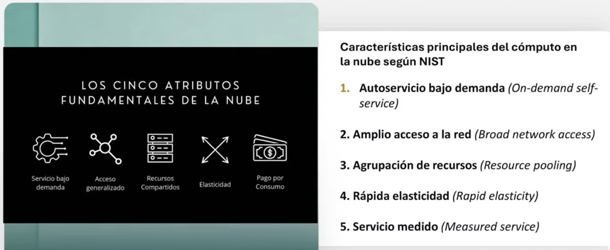
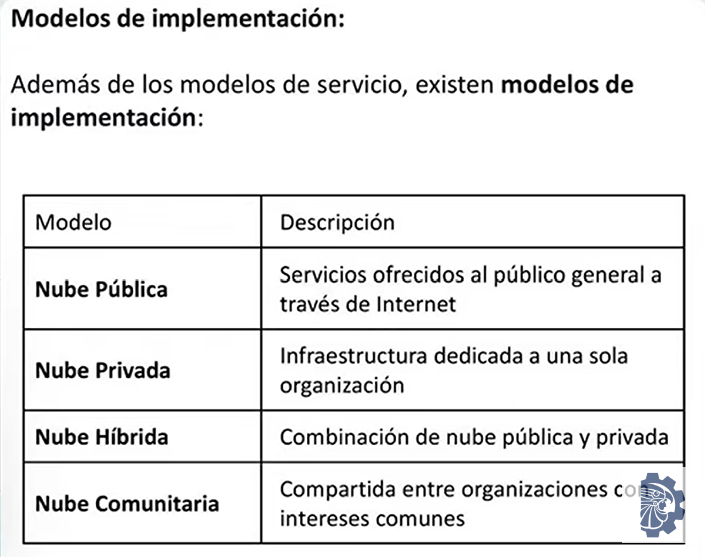

Distintas tecnologias han evolucionado para ofrecer alternativas que peermitan utilizar servicios y recursos informaticos de manera flexoble y eficiente

# que es el computo en la nube?

un modelo que permite accedor a servicios informaticos como servidores, almacenamiento, bd, redes y software

todo lo ofrece un provedor externo

mejorar la accesibilidad a servicios informaticos por medio de modelos de autoservicio y pago por uso

es la entrega de recursos informaticos a traves de internet, sin necesidad de poseer infraestructura fisica propia.

# Caracteristicas

- acceso bajo demanda(como, cuanto y cuando lo necesiten)
- sin intervencion del proveedor(autosevicio)
- acceso mediante interfaz web o API
- acceso desde cualquier lugar con solo a internet sin importar el dispositivo
- escalable(aumentar los recursos segun la adaptacion de la demanda)
- elasticidad(capacidad de crecer o reducirse segun la demanda, evitando pagar recursos innecesarios)
- pago por uso o consumo
- alta disponibilidad(servicios funcionando la mayor parte del tiempo)

## Escalado vertical

aumentar la memoria

## Escalado horizontal

Mas servidores

# Desventajas del computo loca

- inversion inicial alta
- adquirir servidores cada que haya mayor escalabilidad, si la demanda baja los costos se mantienen
- requiere personal especializado
- limitado a la red local
- depende de la infraestructura propia

# Componentes del ecosistema cloud

- centro de datos(instalacion fisica)
- discos de almacenamiento
- equipos de red
- equilibadores de carga
- redes(cableado e componentes fisicos)

- virtualizacion (ejecutar multiples maquinas virtuales)
- servidores(virtuales o fisicos)

- almacenamiento en la nube
- internet como medio de acceso

# Modelos de servicio
Cada modelo representa cuanto hacer tu y cuanto te da el proveedor

## IaaS
infraestructura como servicio

infraestructura basica con un mayor control de parte del usuario, proporciona recursos virtualizados permitiendo a las empresas construir y gestionar su infraestructura TI segun sus necesidades

para organizaciones que buscan flexibilidad y control total

## PaaS
plataforma como servicio

plataforma de desarrllo, especialmente para codigo con gestion simplificada, ofrece un entorno de desarrollo integrado con herramientos y recursos simplificando el proceso de desarrollo

ideal para equipos que necesitan un entorno rapido y eficiente

## SaaS
software como servicio

software listo para usar, acceso por internet y de suscripcion, proporciona aplicaciones listas para usar, ideales para negocios que buscan soluciones listas para usar con bajos costos de implementacion

## FaaS
funcion como servicio

pago por ejecucion, permite ejecutar fragmentos de codigo solo cuando ocurre un evento especifico

## DaaS
escritorio como servicio

escritorios virtuales, ofrece escritorios virtuales donde se pueden acceder desde cualquier lugar solo con internet, todo se ejecuta en los servidores del proveedor

## DBaaS
base de datos como servicio

base de datos administrada, menos mantenimiento del usuario, configurar, operar y escalar la bd sin instalar nada ni gestionar software

# Modelos de implementacion

