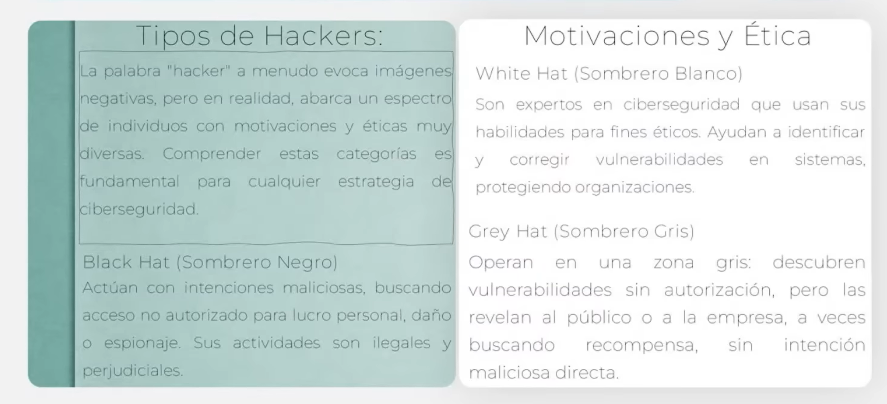

la interconexion digital nos expone a ciberdelincientes que buscan robarnos datos.

el metodo mas seguro de proteger nuestro sistema y datos es la prevencion

# Ciberseguridad
conjunto de tecnologias, procesos y practicas diseñadas para proteger sistemas, redes y datos contra daños digitales, accesos no autorizados y daños

# Medidas
- permisos
- contraseñas

# Principios de ciberseguridad
- confidencialidad: acceso solo a personas autorizadas
- integridad: los datos permanecen completos y precisos y sin alteraciones
- disponibilidad: acceso cuando sea necesario

# Amenazas
con potencial de causar daño a cualquiera de los principios de la ciberseguridad

malware
phising y la suplantacion de la identidad
ataques de denegacion de servicios(Dos/DDoS)
amenazas internas
ffuga y exfiltracion de datos

# Vector de ataque
medio o ruta utilizado para alcanzar el objetivo

correo electronico
credenciales debiles o reutilizadas
software desactualizado
ingenieria social
dispositivos extraibles y redes no confiables
cadena de suministro

# Tipos de hackers

