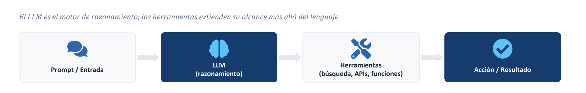
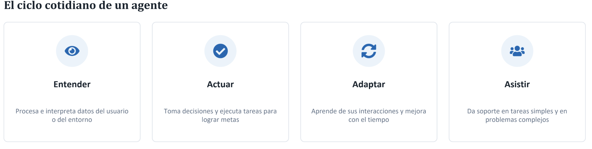
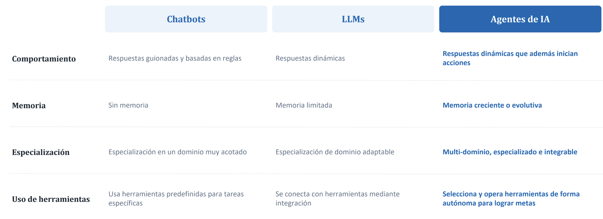
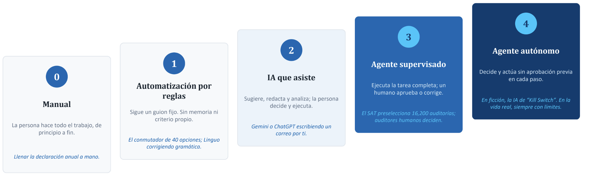
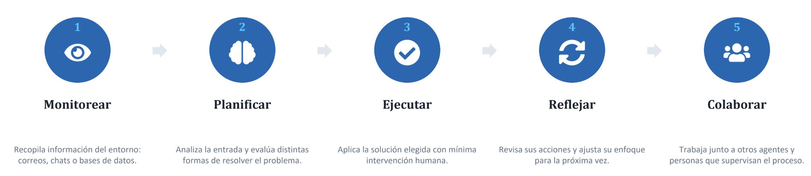

# ¿Qué es un Agente de IA?
Sistema que ejecuta tareas de forma autónoma, diseñando flujos de trabajo con las herramientas disponibles.

Un componente de software que utiliza un Modelo de Lenguaje (LLM) y herramientas externas para actuar de forma independiente, comunicarse con su entorno y tomar decisiones que cumplan metas definidas por el usuario o el sistema.

# ¿Cómo funciona un Agente de IA?

# Chatbots, LLMs y Agentes de IA: diferencias clave

# Cuatro rasgos que definen a un Agente de IA
- Autonomía: Opera de forma independiente y decide sin intervención humana constante.
- Reactividad: Detecta y responde a cambios de su entorno en tiempo real.
- Proactividad: Anticipa necesidades y toma la iniciativa antes de que se lo pidan.
- Colaboración: Se comunica y coordina con personas u otros agentes.

# Siete tipos de Agentes de IA
## Reflejo Simple
Responde a reglas fijas al instante; no aprende ni recuerda.
Ej. un robot aspirador que gira al chocar con un obstáculo.

## Basado en Modelo
Mantiene un modelo interno del entorno para decidir con contexto.
Ej. una aspiradora robot que mapea la casa para planear rutas.

## Basado en Metas
Planifica acciones evaluando resultados futuros posibles.
Ej. Google Maps o Waze, que calculan la ruta óptima al destino.

## Basado en Utilidad
Compara alternativas y elige la de mayor utilidad esperada.
Ej. Uber, que balancea tiempo, costo y oferta de conductores.

## Jerárquico
Divide tareas complejas en subtareas por niveles de control.
Ej. robots de almacén coordinados por un controlador central.

## Sistema Multi-Agente
Varios agentes autónomos colaboran o compiten como pares.
Ej. frameworks como CrewAI o AutoGen con roles especializados.

## Ambiental
Opera en segundo plano y actúa sin instrucciones explícitas.
Ej. agentes de TI tipo Moveworks que resuelven solicitudes solos.

# Del control manual a la agencia: cinco niveles

# El flujo de trabajo agéntico: 5 etapas

Es un ciclo, no una línea recta: tras “Colaborar”, el agente vuelve a “Monitorear” con lo aprendido en la iteración anterior.

Los agentes están asumiendo tres cosas que antes hacían capas enteras de personas: coordinación, enrutamiento de decisiones y síntesis de información.

Las jerarquías se reconfiguran conforme los agentes asumen
coordinación y reporteo.

# Competencias para trabajar con IA Agéntica

Entender cómo piensan y actúan los sistemas agénticos, y dónde sigue siendo indispensable la
persona.
Evaluar las salidas de la IA, detectar sesgos y combinar los datos con el juicio propio.

