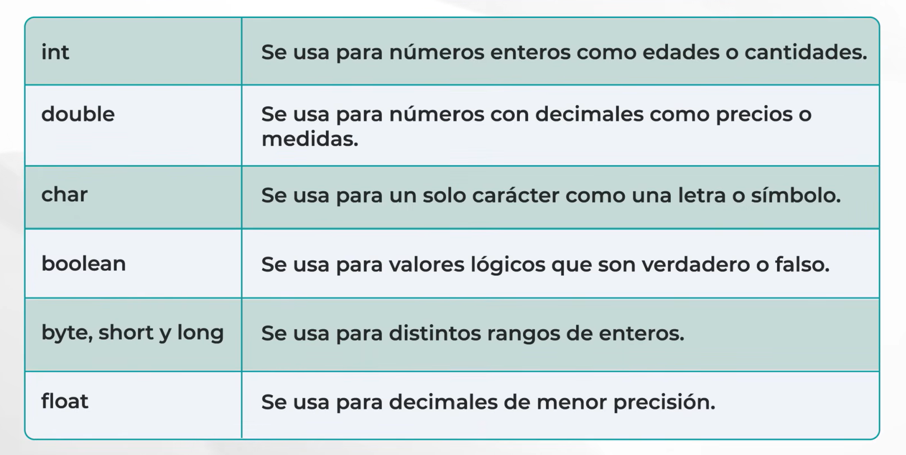
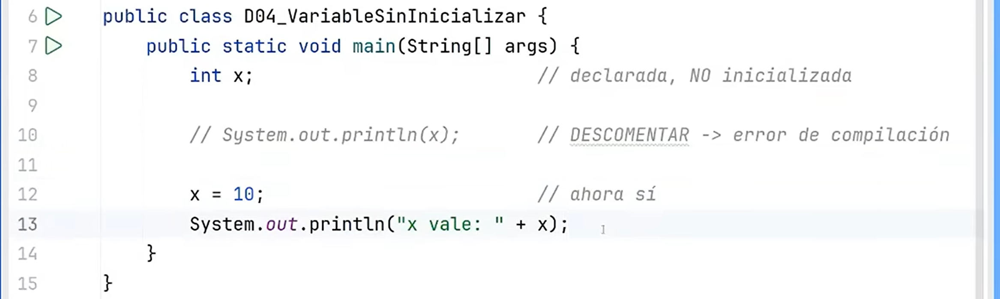
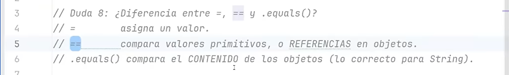
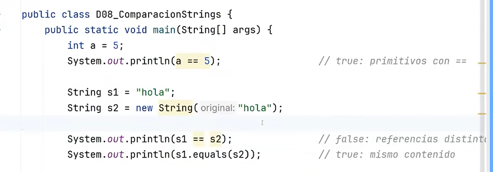

# Caracteristicas
1. lenguaje orientado a objetos
2. es robusto
3. ejecutable en diferentes sistemas operativos
4. cuenta con mecanismos de seguridad 

# Palabras reservadas
palabras que ocupa el lenguaje para su propia sintaxis

# Datos primitivos

siempre en minuscula, guardan directamente un valor

el resto de datos, vienen definidos y respaldados por una clase, todos los que empiezan con mayuscula como String, Integrer

# Variables
todas las variables que estan dentro de un metodo o constructor son variables locales

si estan definidas fuera de un metodo o constructor y tiene static es variable de clase

si no tienen static es variable del objeto

# Operadores logicos
- && AND
- || OR
- ! NOT

# Que es una clase?
una plantilla o molde para crear objetos, agrupa datos y comportamientos, permiten modelar entidades del mundo real con sus caracterisitcas y comportamientos