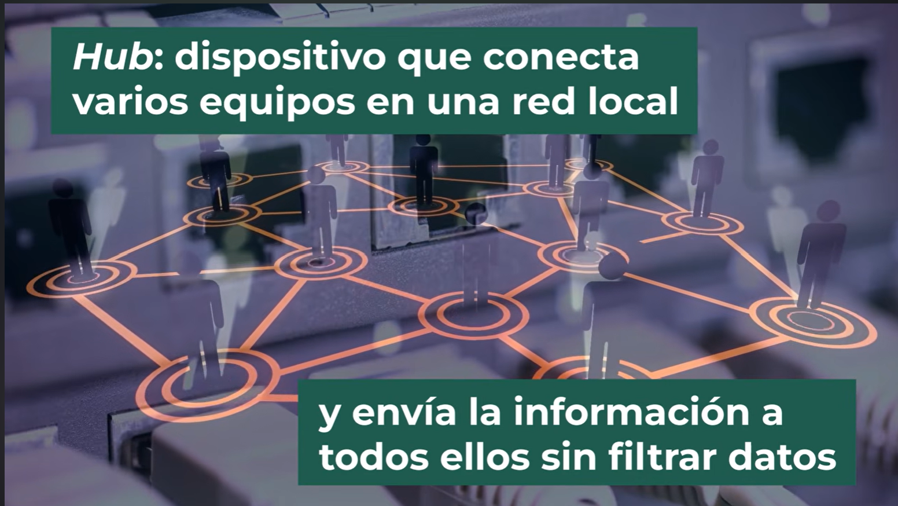
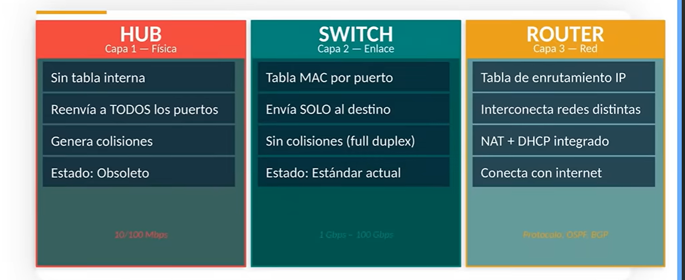
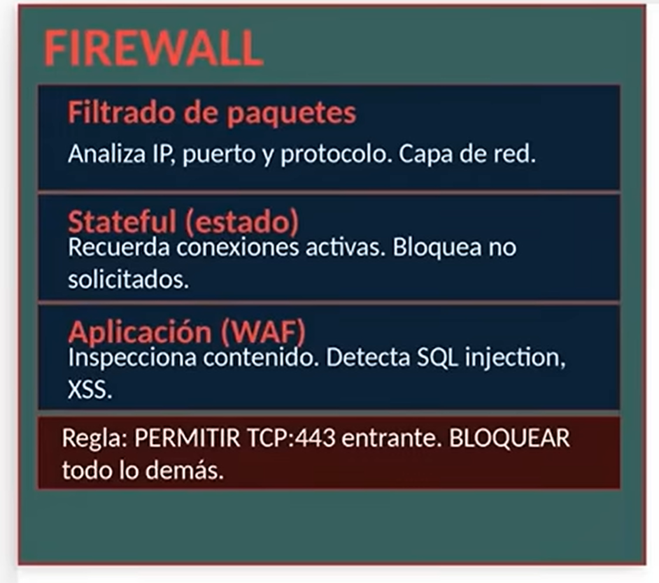

# Dispositivos de interconexión
componentes físicos que permiten que los equipos se comuniquen entre sí y con otras redes. Cada uno opera en una capa diferente del modelo OSI y cumple una función  específica.

## Hub

Capa 1 del modelo OSI

Simplemente repite la señal eléctrica que recibe por un puerto hacia todos los demás puertos simultáneamente, sin importar a quién va dirigida la información. Esto genera un dominio de colisión compartido entre todos los dispositivos conectados.

## Switch
Capa 2 del modelo OSI

El Switch aprende la dirección Mac de cada dispositivo conectado a sus puertos y construye una tabla interna, tabla MAC.

Cuando recibe una trama, consulta esa tabla y la envía exclusivamente al puerto donde está el destinatario, sin interferir con los demás dispositivos(elimina las colisiones y permite que múltiples comunicaciones ocurran en paralelo).

Tabla mac por puerto, sin colisiones(full duplex) y es el estandar actual

hay algunos que ya manejan direcciones tanto fisicas como logicas

## Router
Capa 3 del modelo OSI

maneja direcciones fisicas pero principalmente, direcciones logicas

tiene 2 elementos complejos dentro, uno fisico y otro logico, especifico ara manejar redes de diferentes tecnologia(interconecta redes distintas).

Se encarga de interconectar redes distintas, incluyendo la conexión de una red local con internet.

Toma decisiones de enrutamiento basadas en las direcciones IP de destino y en tablas de enrutamiento(manuales o dinamicas).

# Firewall
Un firewall es un sistema de seguridad que monitorea y controla el tráfico de red entrante y saliente según un conjunto de reglas predefinidas. Su objetivo principal es proteger una red interna de accesos no autorizados provenientes del exterior sin bloquear el tráfico legítimo.

Tambien de que el interior consulte paginas o accesos no permitidos 

### Tipos
El firewall de filtrado de paquetes examina cada paquete de red de forma individual y decide si permitir o bloquear según la IP de origen, la IP de destino, el protocolo y el puerto.
el firewall de estado stateful, además de analizar cada paquete, recuerda El estado de las conexiones activas. puede distinguir si un paquete pertenece a una conexión ya establecida o si es un intento de acceso no solicitado.
El firewall de aplicación WF. Este opera en la capa de aplicación y puede inspeccionar el contenido de las comunicaciones detectando ataques específicos como inyección SQL o crosssite scripting en aplicaciones web.

# Access Point o Wireless Access Point
Punto de acceso inalámbrico

Es un dispositivo que permite conectar equipos inalámbricos a una red cableada existente. Actúa como un puente entre el mundo Wi-Fi y la infraestructura de cable UTP o fibra de la red.

Los APS se conectan al switch de la red por cable y los dispositivos móviles se asocian al AP con mejor señal en su ubicación.

La seguridad de una red Wi-Fi es crítica porque la señal inalámbrica puede interceptarse sin acceso físico a la infraestructura.

# Buenas prácticas de seguridad Wi-Fi
Usar contraseñas de al menos 12 caracteres con combinación de letras, números y símbolos.
Cambiar el SSID por defecto del router para no revelar el fabricante.
Desactivar WPS Wi-Fi protected setup, ya que tiene vulnerabilidades conocidas.
Usar WPA3 cuando todos los dispositivos losoporten. En caso contrario, WPA2.
Separar la red de invitados de la red principal mediante SSID independiente. 
Actualizar el firmware del router periódicamente.