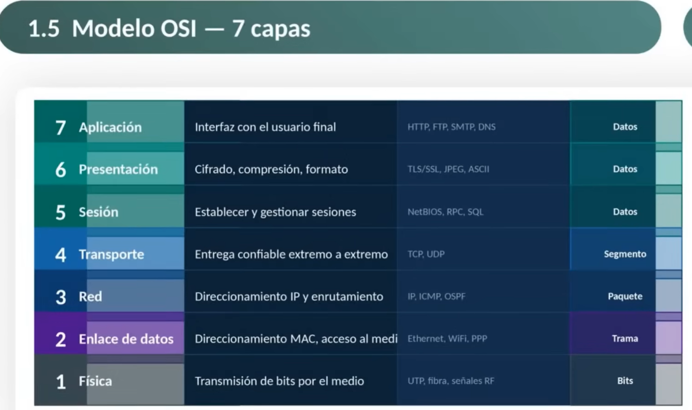

No todas las redes son iguales. Antes de poder iniciar a ver cómo funcionan las redes, es necesario categorizarlas.

# LAN
redes de área local, Las redes de área local son dispositivos que interconectan de en una área geográfica muy pequeña.

una LAN es una red que tiene una conexión en una infraestructura que normalmente es propiedad y responsabilidad de una organización.

el alcance geográfico es limitado, generalmente está entre 100 m y 3 km,tiene alta velocidad de transmisión. También tenemos baja latencia (la
comunicación entre dispositivos es prácticamente instantánea). El costo de implementación es muy bajo.

La administración interna
es algo que es definitivamente para la parte de una LAN

# WAN
red de redes de área amplia. tenemos ciertos componentes que son exclusivos para LAN y ciertos componentes que son exclusivos para WAN. 

en una WAN nosotros tenemos rutas de acceso público o de acceso privado, es decir, algunas proveídas por el gobierno y algunas que son este propietarias de algunas empresas

normalmente estas redes conectan varias redes LAN al mismo tiempo y están separadas geográficamente.

podemos llegar a varios kilómetros con una inalámbrica. 

El único detalle es de que estas tienen que tener línea de vista, line of site, y esto significa que no debe de haber nada en medio. 

## Cable UTP
Sus pares están entrelazados de forma intencional para reducir las interferencias que se generan entre sí. ideal para entornos con mucha interferencia eléctrica
lo que transmite son este pulsaciones electromagnéticas

## Fibra optica
transmite pulsos de luz a través de un hilo de vidrio ultrapuro. La luz rebota dentro del hilo mediante un fenómeno lamado reflexión interna total. lo que le permite recorrer grandes distancias con muy poca pérdida de señal.

La fibra óptica viene por dos elementos muy identificables, la monomodo y la multimodo. El monomodo eh nos permite conectarnos a más distancia. Sí, la multimodo nos permite conectarnos con eh a menor a menor distancia, pero con mejor eh sensibilidad.

todo depende de dónde la vayamos a usar, La fibra óptica transmite datos como pulsos de luz.

en realidad hay pérdidas pérdidas precisamente por estos rebotes o por las curvaturas propias de la de la misma fibra en la forma de cómo se monta o cómo se se o cómo se dispone.

Si nosotros lo queremos tener a la máxima velocidad, entonces tenemos que bajar este el tamaño y al revés. Eh si nosotros queremos tener mayor distancia, entonces tenemos que bajar la velocidad.

prácticamente inmune a las a las interferencias electromagnéticas.

## WI-FI
permiten conectarse sin cables mediante ondas de radio. Por ello son medios inalámbricos, uso de múltiples antenas para transmitir varios flujos de datos al mismo tiempo.

Normalmente utilizamos UTP para trenzado y comunicación inalámbrica, la llamada Wi-Fi.

## Bluetooth
tecnologia de comunicación inalámbrica de corto alcance diseñada para la interconexión de dispositivos electrónicos dentro de un espacio personal o de área personal.

PAN Personal Area Network, sin necesidad de cables.

## Redes celulares
permiten comunicarse en movimiento desde cualquier lugar con cobertura. El territorio se divide en zonas llamadas  celdas, cada una atendida por una antena. Cuando el usuario se desplaza de una celda a otra, la red transfiere la conexión automáticamente sin interrupciones.

El cable de cobre ofrece un canal dedicado sin interferencias, mientras que la señal inalámbrica comparte el espacio con otros dispositivos y se debilita con las paredes.

# Tipos de topologias:
Existen topologías lógicas y
topologías físicas. 

Las topologías físicas es la disposición en cómo se encuentran dispuestos, valga la redundancia, físicamente.

# comunicación electromagnética o comunicación inalámbrica
se utiliza por medio de propagación, alcance y velocidad.

podemos llegar a tener un concepto que se le conoce como el transmisor fuerte y receptor débil y viceversa. 

Entre mayor este distancia nosotros pongamos entre el dispositivo receptor y nuestro dispositivo emisor, entonces menos va a ser la velocidad y menos va a ser la fiabilidad de esta conexión. 

# Ancho de banda
la capacidad de un enlace para transmitir un volumen de datos. en un periodo determinado de tiempo.

Por lógica, entre mayor sea el ancho de banda, mayor número de datos vamos a poder transmitir en un mismo segmento de tiempo. 

a mayor este ancho de banda, nosotros podemos transmitir más en el mismo instante de tiempo.

# Latencia
a latencia entonces es el tiempo que tarda los datos en viajar desde el origen hasta el destino(se mide en milisegundos).

Paquetes más cortos, obviamente viajarán más rápidos, paquetes más grandes, pues tardarán más o tendrán mayor latencia y este y esto pues genera también que el dispositivo de respuesta, el dispositivo de de que lo recibe pues también llega a tener algunos problemas. 

porque nosotros necesitamos evitar esa latencia.

# Rendimiento
Es la cantidad de datos que se transfieren de manera exitosa. Pero aquí el detalle es cuántos datos efectivos se transmiten en un periodo determinado.

la idea es de que siempre sea igual o menor que el ancho de banda típico, ya que este los paquetes de otra manera se se sobrecargarían. las retenciones por estos este por estos errores o las las pérdidas por estos
errores pues se pueden llegar a dar este en colas de esperas

se pueden dar este por retransmisiones, por errores, por congestión de la red, por este porque alguien está transmitiendo, por ejemplo, al lado de nosotros y está utilizando este mayormente el ancho de banda

# Modelo OSI

Es finalmente en la capa de enlace de datos es donde se le da nombre
a un direccionamiento MAC. El la dirección Mac o mejor dicho la capa este de enlace de datos está dividida en dos partes, en este en el control de acceso al medio y en la este y en la subcapa de Mac.

