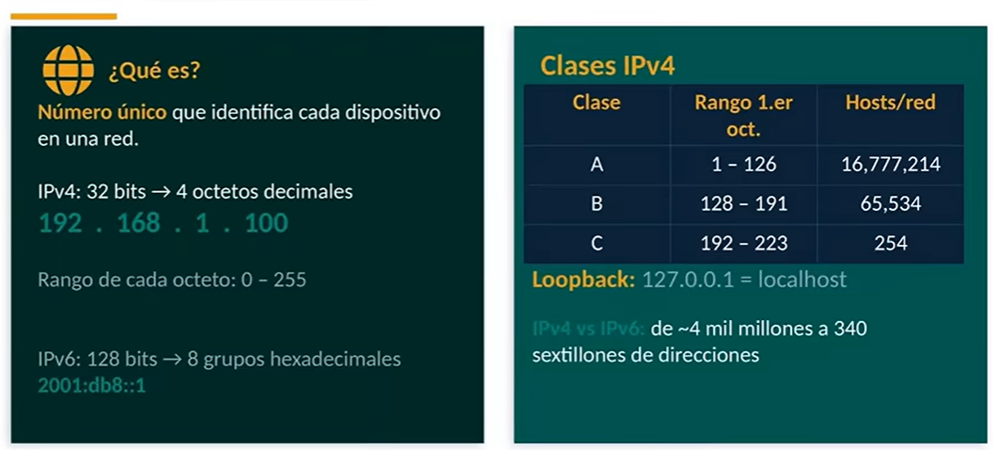
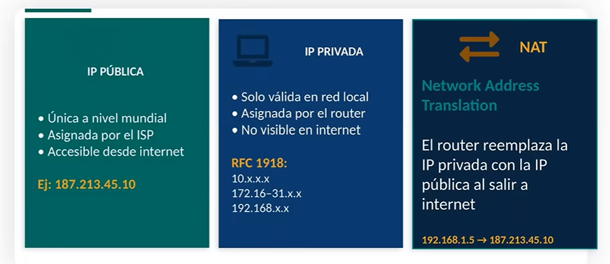

#  ¿qué es una dirección IP?
Cada dispositivo que se conecta a una red, requiere esta identificacion, una identificación única que permite a los demás dispositivos localizarlo y encontrarlo para poder enviarle o recibir información acerca
del mismo.

hay dos tipos de identificaciones, la física y la lógica. En el caso de la IP es una identificación lógica.

Una dirección IP es un número asignado a cada dispositivo y conectado eh a una red. Y digo asignado de manera específica porque a diferencia de una dirección MAC que se recibe desde el momento de la de la de la fabricación de la tarjeta de red, en el caso de la de la dirección IP es asignada por el administrador, ya sea de manera automática o de manera específica, pero es una dirección que está en control del administrador de la red, es decir, no es una dirección que venga de fábrica, nosotros la podemos modificar.

el direccionamiento físico es aquel que se da por medio de la dirección MAC, es decir, la dirección que se asigna desde la fabricación del dispositivo de red.

¿Cuál es la diferencia principal con IPv6? Bueno, en el caso de IPB6
ya no se maneja en binarios, sino se manejan en hexadecimales y tenemos ocho grupos de hexadecimales. Esto nos da como resultado que nosotros tengamos muchas más direcciones o muchas más posibles direcciones en el caso de IPv6. 

La dirección de broadcast es la última dirección, sería como si fuera la tapa del sándwich. La dirección de red es una y la dirección de broadcast es la otra. Y lo que se encuentra contenido entre estas dos es entonces las direcciones asignables dentro de la red.

No todas las direcciones IP funcionan de la misma forma o no para el mismo para la misma función. Algunas identifican dispositivos directamente este accesibles por internet como por ejemplo direcciones, mientras que otras son solamente válidas para una red local.

Eso significa que cuando yo me conecto en casa, yo tengo una red local y esas direcciones que me asigna mi dispositivo de interconexión, llámesele router, solamente me van a servir para mí. 

las direcciones públicas son únicas a nivel mundial, mientras que las direcciones privadas solamente son válidas a nivel local.

la dirección pública la asigna por medio del proveedor de servicios de internet y es accesible desde internet, mientras que las direcciones privadas son asignadas por el propio router por una configuración previa o por el tamaño de la red y no son disponibles y no son visibles en internet.

En el lado del NA DAT que vemos más a la derecha, el router reemplaza la
dirección IP privada por la IP pública para poder salir y entrar a  internet y viceversa. 

# máscaras de red
da la propiedad del rango de direcciones que se manejan dentro de la propia sub red. 

Estamos hablando de una red particular, por ejemplo, de una red privada local, pero que a la vez la subdividimos, valga la redundancia, en sus redes con la finalidad de poder administrarlas. ya sea por funciones lógicas o por funciones eh de administración en particular de dispositivos interconectados. 

Entonces, cuando llegan los invitados, se les asigna una un direccionamiento de una subred que está controlada, una subred que tiene un ancho de banda específico, una subred que tiene ciertos elementos para para utilizar en específico y determinadas cosas.

Le había habíamos platicado que el broadcast es un elemento de multidifusión o la difusión que se traduce el broadcast es precisamente esa conexión por medio de la cual nosotros estamos replicando  los mensajes dentro de la propia red, dentro de una red local. El broadcast pues es dañino si no se administra de manera correcta. en una red one. Nosotros necesitamos de esa multidifusión precisamente para que llegue a su destino por el mejor camino o por alguno de los caminos disponibles.

