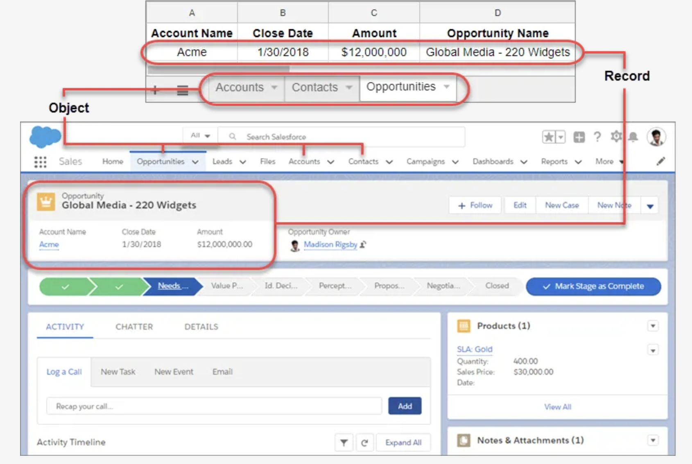

# ¿Qué es Salesforce?
Plataforma, la cual se ha diseñado para facilitar la venta, el servicio, el marketing, el análisis y la conexión con los clientes.

Mediante el uso de productos y funciones estándar, puede gestionar las relaciones con los prospectos y clientes, establecer relaciones y colaborar con empleados y socios, y almacenar sus datos de forma segura en la nube.

# ¿Qué es CRM?
Servicio de gestión de las relaciones con los clientes. Permite gestionar las relaciones con sus clientes existentes y potenciales, y hacer un seguimiento de los datos relacionados con todas sus interacciones.

Ayuda a los equipos a colaborar de forma interna y externa, recopilar perspectivas de redes sociales, hacer un seguimiento de mediciones importantes y comunicarse mediante email, teléfono, redes sociales y otros canales.

# ¿Cómo organiza Salesforce sus datos?
Salesforce organiza sus datos en objetos y registros. Puede pensar en objetos como una ficha en una hoja de cálculo y un registro como una sola fila de datos.

- Registro: Un elemento que sigue en su base de datos, es una fila de la hoja de cálculo.
- Campo: Un lugar donde almacena un valor, como un nombre o una dirección, sería una columna en la hoja de cálculo.
- Objeto: Una tabla es la base de datos, un objeto es una ficha en la hoja de cálculo.
- Org: Abreviatura de “organización”, la ubicación donde todos sus datos, configuración y personalización radican. Usted y sus usuarios inician sesión para acceder a ella. Es posible que escuche la denominación “su instancia de Salesforce”
- Aplicación: Un conjunto de campos, objetos, permisos y funciones para cubrir el proceso de negocios

